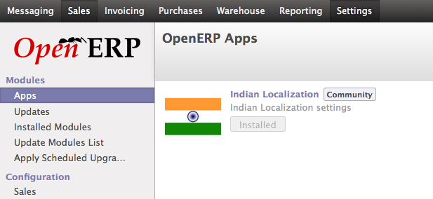

.. _install-application-l10n_in_base:

.. index::
	single: Indian Localization

Indian Localization Configurations
==================================

.. note::
	Before you proceed for the installation you should know the difference between :ref:`OpenERP Apps vs Module <get-start-module-apps>`. If you are going to install modules that is available locally, make sure your are on latest version of that modules. Its better to work with the OpenERP Apps store that always deliver latest in terms of ``versions`` along with the ``bug fix`` and ``improvements``.

Install
-------
To install the Indian localization Goto Settings → Apps and search for the ``l10n_in_base`` and click on Install button of Indian Localization, community apps.

Indian Localization Configurations

It may ask you for the username and password for OpenERP.com account on successfully login it will download and install the best version for Indian Localization from apps store.

Post Install
------------
On successfully installed Indian Localization ``l10n_in_base`` you will get a page under Settings → Configuration → Indian Localization. You can choose depending what you want to install as a feature from the Indian localization.

.. image:: images/l10n_in_base_configuration.png

Indian Localization Configurations