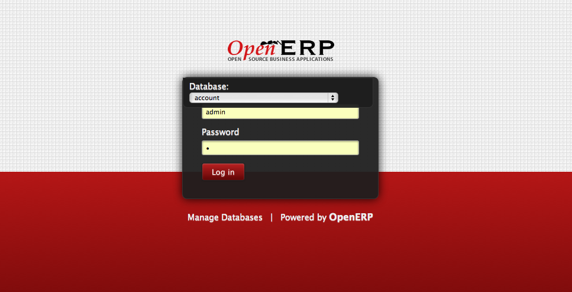
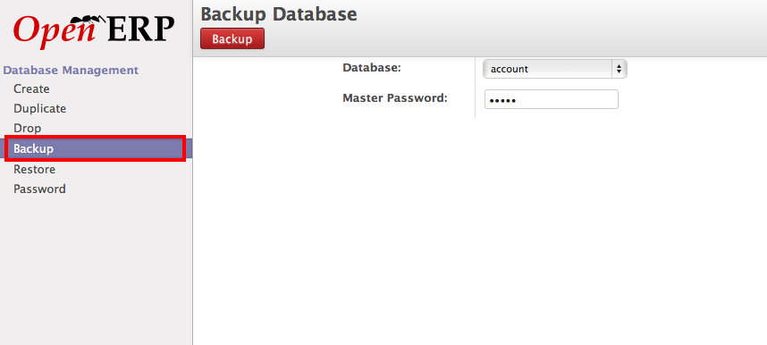
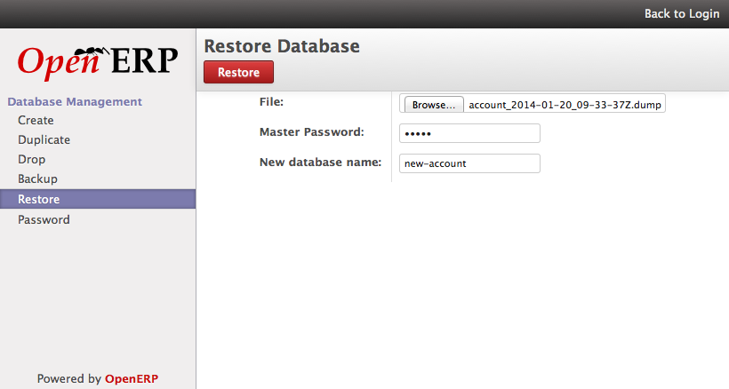

.. _backup-restore-manual:

Backup and Restore of OpenERP Database
======================================

There are various ways for backup and restore of the OpenERP database depending on which platform you are using. There are two main platforms for using OpenERP. Using OpenERP Online by creating an online Instance or Installing OpenERP on your local server.

Local installed OpenERP Server
------------------------------

Well, when you have local installation I assume that you have the full control over your installation including server. there are two different ways taking back and restore of your OpenERP database. Backup and restore through OpenERP Interface or using PostgreSQL backup and restore command which is pure backup and restore given by the PostgreSQL database provider, although OpenERP's backup restore through Interface using the same internally.

Backup through OpenERP Interface
~~~~~~~~~~~~~~~~~~~~~~~~~~~~~~~~
It is very easiest way and you just need an Super Administration password for OpenERP which is different then the Database password. Check How to find the Super Administrator password.

Login Page
~~~~~~~~~~
Click on Manage Databases from your login page of your OpenERP instance. In case if you are not able to see that option, you can not take back and restore from OpenERP's interface as it is disable from the OpenERP configuration and you don;t have other choice then taking backup through PostgreSQL commands on your server physically or through SSH.

Backup Database

Select the database to back under the backup option and enter the Super Administrator password which is not a database password and click on Backup button.  If everything goes well on server it will ask you to save the backup file which is an actual backup of your OpenERP's database and that's done !

Restore Database OpenERP Interface
~~~~~~~~~~~~~~~~~~~~~~~~~~~~~~~~~~
You can move that dump file to any other server or keep for the restoration purpose as well. In case if you plan to move that dump to any other server check the compatibility and the version of PostgreSQL at source and  target server if they are same you just need to select that file under the Restore option give Super Administrator password and give a new database name which will be created to restore the database.

Restore Database

Backup through Command Line Interface
-------------------------------------
Alternative to OpenERP's Database management tools, you can also use Linux command line interface tools by PostgreSQL's backup and restore or psql command to backup and restore the database.

Check the database list available on the PostgreSQL Server

::

	openerp-air-2:7.0 openerp$ psql --list
	                             List of databases
	   Name    |  Owner   | Encoding | Collate | Ctype |   Access privileges
	-----------+----------+----------+---------+-------+-----------------------
	 account   | openerp  | UTF8     | C       | C     |
	 postgres  | postgres | UTF8     | C       | C     |
	 template0 | openerp  | UTF8     | C       | C     | =c/postgres          +
	           |          |          |         |       | postgres=CTc/postgres
	 template1 | postgres | UTF8     | C       | C     | =c/postgres          +
	           |          |          |         |       | postgres=CTc/postgres
	(4 rows)

Once you decide which database you would like to backup, enter the following to create a backup file.If you have not installed Document Management system or if you have not many files attached the database record this is the suitable options to create a text backup of your database.

::

	$ pg_dump account &gt; account.sql

Incase if you have have attached many files to database or you have installed Document Management module and using extensively you should create a backup using below command.

::

	$ pg_dump account | gzip &gt; account.gz

It will create a multi-file tar backup and better to compress with the gzip tool to reduce the size of the backup of database specially when you are working with large database included blob objects like files.

Restore through Command Line Interface
~~~~~~~~~~~~~~~~~~~~~~~~~~~~~~~~~~~~~~
You should check the compatibility  of PostgreSQL database version before restore incase your target server is not same then the backup server . Before you restore backup you have to create a new database your self with the below command and then you can restore the backup.

::

	$ createdb new-account --eocoding=UNICODE
	$ psql new-account &lt; account.sql

In case if you have take the backup of the large file like account.gz you should use the below command to restore the database.

::

	$ createdb new-account --eocoding=UNICODE
	$ gunzip -c account.gz | psql new-account

You use below command to restore large backup file

::

	cat account.gz | gunzip | psql new-account

Thats all, You done with the backup and restore of OpenERP database in case of OpenERP installed on your server locally.

.. note:: 
	When you are working with large database use the command line interface to take the backup and restore with -c option to compress the file and take large blob objects.

You can also create a custom file format at the time of backup of database using pg_dump, the advantage of taking custom file format is you can select only few tables for the restore process on target server. You have to use the pg_dump command as below

::

	$ pg_dump -Fc account > account.gz

And you can restore using the pg_restore command as below

::
	
	$ createdb new-account --eocoding=UNICODE
	$ pg_restore -d new-account account.gz

OpenERP Online Instance
-----------------------
OpenERP Online takes care for the customers backups, It takes daily backup of your database and keeps the last one week of the backups in the system. You can access and download those backups from your OpenERP account at https://accounts.openerp.com login with your OpenERP account.

You should a paid customer else your database will not be backup automatically as it will be dropped after 15 days of free trial usage.