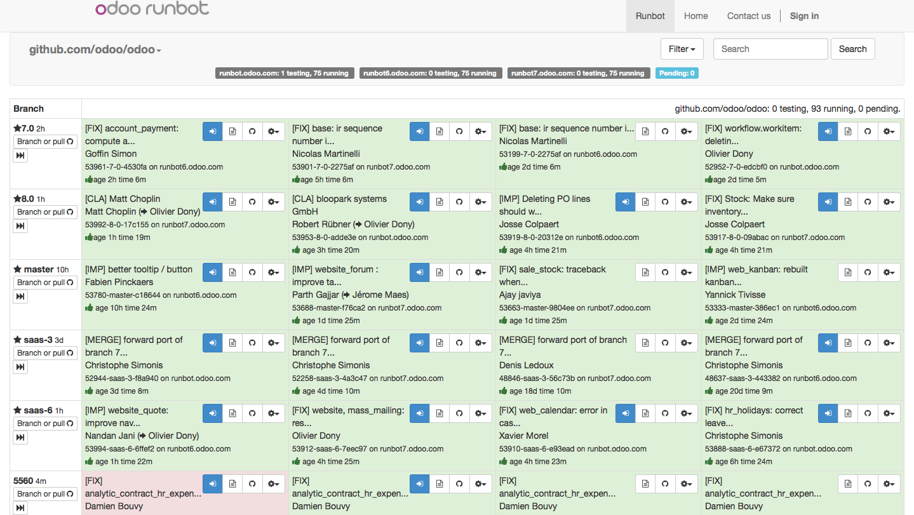

.. _version:

.. index::
   single: OpenERP Demo
   single: Demo for Community and Developers
   single: Demo Evaluator Users

=================
Odoo Test Drive !
=================

demo.odoo.com
--------------

Odoo instant demonstration can be found at `Odoo Online Demo <https://demo.odoo.com>`_. Odoo online demo for the lambda users who wanted to play with Odoo Apps on the fly, You will be not recall your test data and cases as it reset the data on interval. Version offered on online demo is not fixed most of the time it is from master branch to evaluate the lambda user behaviour.

runbot.odoo.com
---------------

Odoo Runbot is integrated test platform developed by Odoo, integrated with github.com/odoo testing each and every branch for the single committe. Odoo Employees worldwide use this platform for the internal testing before merging any feature in to Master branch.

Background colours of an instance represents the status of the instance, Green represents build Success and Red represents failurd in installation or test cases.

Sticky Branches
~~~~~~~~~~~~~~~
Branches with star known as a stick branch all the major version are display as a sticky branch allows you to conect quickly. It increase the productivity of Odoo internal employees for testing bugs or new features. 

Pull Request Branches
~~~~~~~~~~~~~~~~~~~~~
All the branches on github.com/odoo/odoo repository with the number represents a pull request placed by the developers, specially merge team internall checks a branch for the pull requuest status on runbot and check the fearures by entering in to the instance and process the pull requests.

Feature Branches
~~~~~~~~~~~~~~~~
All the beanches listed on github.com/odoo-dev/odoo repository are the feature branches developers working on it. 

.. warning::
	Runbot is not suitable to prepare a customer demo as no guarantee to get the same data all the time, because several users using those instances so data may change without notifications.

odoo.com/start
--------------

Creating online instance is the best way to present Odoo infront of customers, visit http://www.odoo.com/start page to start the Odoo Apps to install.

4 Hrs Free Trial
~~~~~~~~~~~~~~~~

Instance created from https://odoo.com/start page is valid till 4 hours only, If you would like to make it available later do not firget to register with your Odoo Online Account. 

15 Days Free Trial
~~~~~~~~~~~~~~~~~~

Instance registered with Odoo Online Account is free for online use for 15 days only. 

Free for 2 Users
~~~~~~~~~~~~~~~~

Since the release of Odoo 8.0 gives the free account for unlimited time for 2 users only. Odoo Online instance is professional way to get started with Odoo evaluation as many features works on Odoo Online out-of-the-box can increase your confidence on Odoo. It is best platform where you can give free access to your customers to play with Odoo after first demo.

