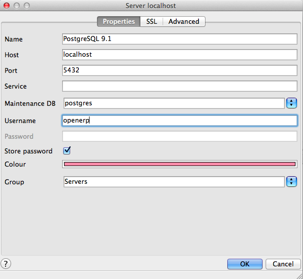

.. _pgadmin3:

.. index::
   single: PgAdmin3

Configure PostgreSQL for PgAdmin3
=================================
PostgreSQL does not install any graphical user interface for the Database administration, for a graphical user interface of postgresql, use the following command on your Ubuntu Desktop client:

::

	openerp@openerp-desktop:/$ sudo apt-get install pgadmin3

Configure PostgreSQL for the PgAdmin 3 to connect with databases.  Now check the list of tables created in PostgreSQL using following command:

::

	postgres@openerp-desktop:/$ psql -l

You can find the table template1, run the following command to use this table:

::

	postgres@openerp-desktop:/$ psql template1

To apply access rights to the role openerp for the database which will be created from OpenERP Client, use the following command:

::

	template1=# alter role openerp with password 'postgres';
	ALTER ROLE

Test Connection
---------------

To access your database using pgAdmin III, you must configure the database connection as shown in the following figure:

PgAdmin3 Connection Configuration

