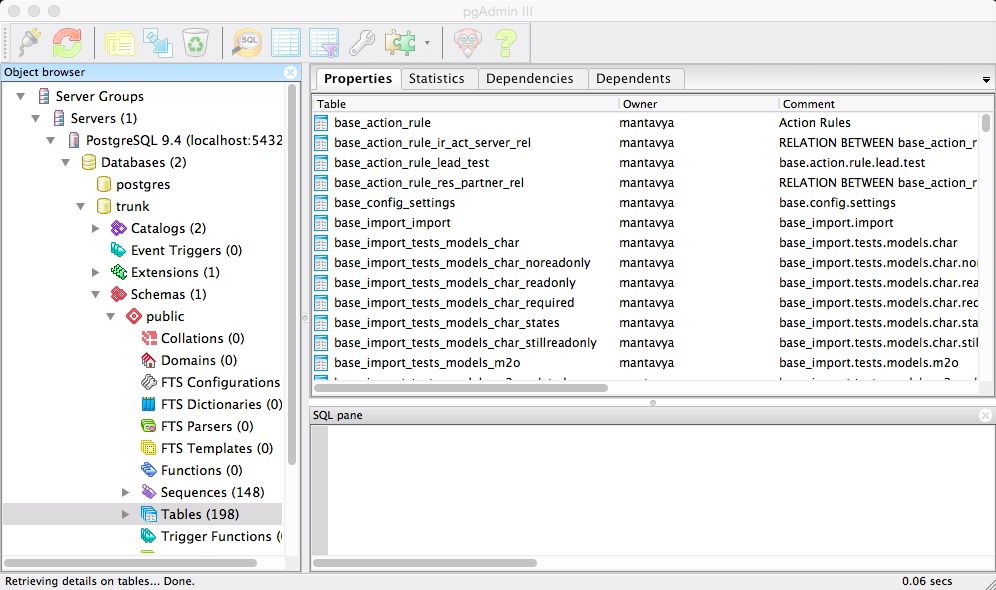

.. _pgadmin3:

.. index::
   single: PgAdmin3

=================================
Configure PostgreSQL for PgAdmin3
=================================

PgAdmin 3 is database manager for the PostgreSQL, however it does not installed on the some platform along with the installation of PostgreSQL. PgAdmin3 will be install on Windows and Mac along with the PostgreSQL, to install on Linux you need to install some additional packages and need some configure.

Install & Configure
-------------------

Install pgadmin3 on Ubuntu

.. code-block:: shell

	openerp@openerp-desktop:/$ sudo apt-get install pgadmin3

Or install pgadmin3 on Fedora, CentOS, Redhat

.. code-block:: shell

    openerp@openerp-desktop:/$ sudo yum install pgadmin3

Default password for the user ``postgres`` is not set, to connect pgadmin3 with PostgreSQL you need to reset the password of postgres user. Use the command below to reset the password. 

Check for database template1 and connect to the same

.. code-block:: shell

	postgres@openerp-desktop:/$ psql -l
    postgres@openerp-desktop:/$ psql template1

Reset the pasword for the postgres or any other user you plan to use to manage your databases, run below command to reset the password.

.. code-block:: sql

	template1=# alter role postgres with password 'postgres';
	ALTER ROLE

Test Connection
---------------

To access your database using pgAdmin 3, you must configure the database connection as shown in the following figure:

.. image:: images/pgadmin3.png

Click on Ok to save server settings and you will be asked for password each time when you connect to the PostgrSQL server.
