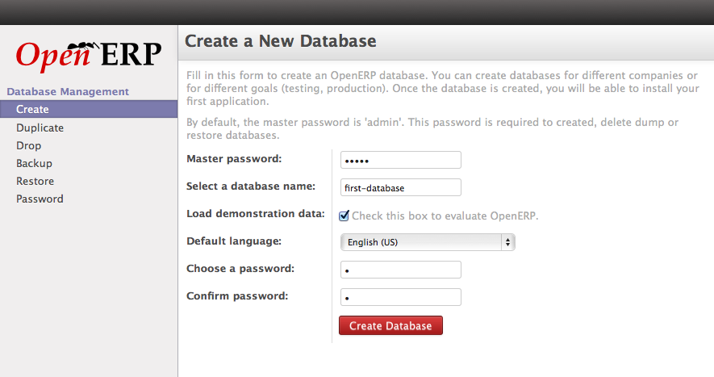

.. _get-start-create-db:

.. index::
   single: Create Database
   
Creating Database in OpenERP
============================
:ref:`After successfully installation of OpenERP <install>` in to your local server you can create a first database in to your OpenERP Local instance.

.. image:: images/login-page.png

Login Page

Manage Database
---------------
Goto Manage Databases option from the Login page and enter Master Password, Database Name,  Load Demo data, and Choose a Database Password and click on create button to create a Database.

Create Database

On successful database creation you will get the Apps List which allows you to install Application from OpenERP Apps store.

.. image:: images/apps-list.png

Apps list from OpenERP Apps

You need an active account on OpenERP.com in order to install Apps from OpenERP's Apps store. You can also working with the Installed modules if you have developed an OpenERP module and like to test it locally.