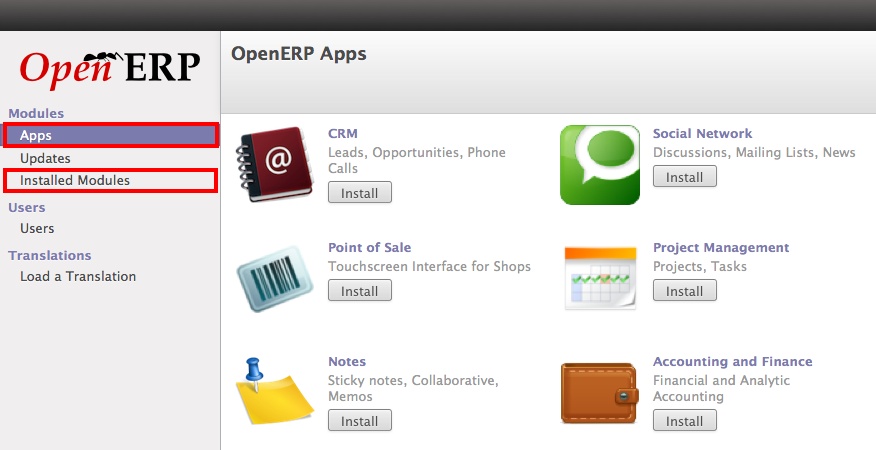

.. _get-start-module-apps:

Module vs App in OpenERP
========================
Since the release of OpenERP 7.0, OpenERP Apps store is integrated with all the installations of OpenERP whether they are onsite or online. You don't need to maintain the add-ons in your local installed server when you are working with OpenERP 7.0.

.. image:: images/apps-store.png

OpenERP Apps Store

Module and Apps
---------------
Modules in OpenERP is a business application or an extension to existing business application, when you install any module in OpenERP it checks for the dependency, if they found in local add-on directory they will be installed automatically but what if you have download some module and you don't know which dependent module to download ?

Modules and Apps menus in OpenERP

Apps view in Store
------------------
It will be difficult to working with the community apps or module without OpenERP's Apps store as when you install module from Apps, OpenERP Apps store takes care for the module dependency and all the dependent module will download automatically from the apps store.

.. image:: images/non-cert-apps.png

Non Certified OpenERP Apps

Yes, OpenERP is not giving any guarantee for any of the community module as those are not the OpenERP's official add-ons  but its a community add-ons and an active developer or community members or parters they takes care for for those apps.

You can add your modules to OpenERP Apps store, you just need your module to be on the Launchpad where the OpenERP's Project hosted.