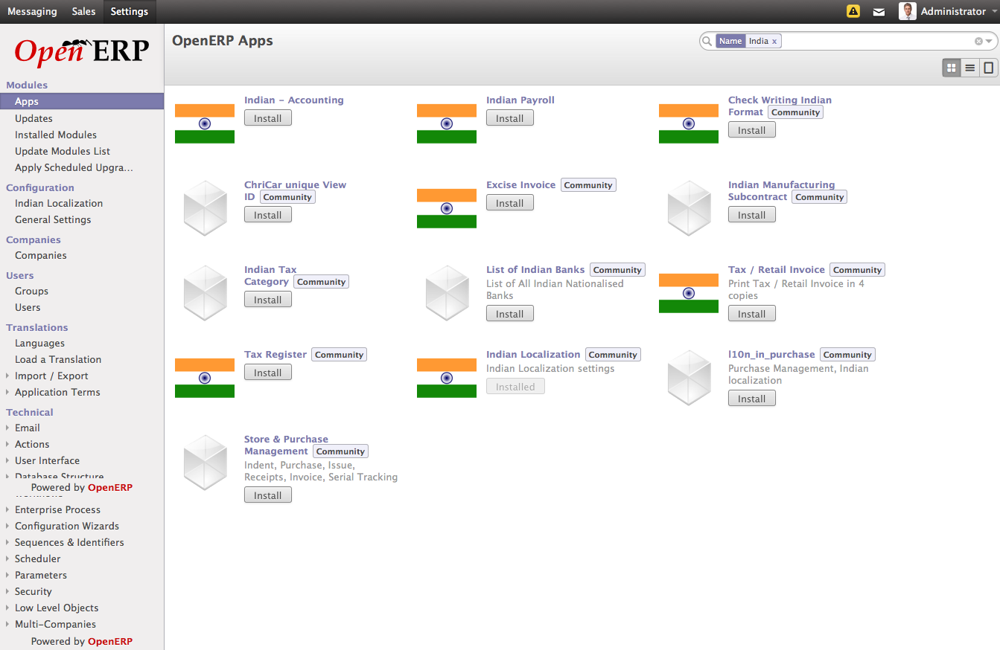
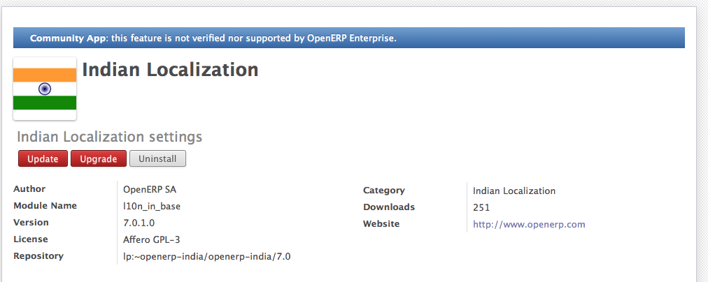

.. _get-start-module-manage:

Install and Manage Modules in OpenERP
=====================================
Installing module in OpenERP is not as complex as installing OpenERP it self. It is very easy to install and uninstall modules in to OpenERP after understanding the difference between Modules and Apps of OpenERP.

Developers, who are familiar with the Launchpad, is no big difference between Modules and Apps, but for the end users its a big difference.

If someone ask you to download few packages to download from the RPM list with dependance respect to version and architecture  it will become too complex to instal such packages on your rpm based Linux system but installing a module using yum or apt-get will be easy no need to take card about the dependency.

Install Module from Apps Store
------------------------------
OpenERP has online and free apps store where all the apps comes from the repository available at development platform Launchpad.net. Modules comes from the different branches of different projects and available for different version based on the registrations. You can also publish your module on the OpenERP Apps store as well.

.. image:: images/apps-store.png

OpenERP Apps Store

OpenERP has integrated this apps store to your local installation in terms of Apps menu available under the Settings. You can search, browse and install any of the module you want.

Apps from OpenERP Apps store

You no need to worry about the versions and dependance, it will be taken care by your instance and download all the dependent module automatically from apps store.

Module Updates
--------------
One of the very good features about the OpenERP apps store is the Update system. When author of the module release bug fix of improvements, by changing the minor version of module, you will get those modules under the update list which shows that a new version of the same app available on store. You can read the change log supplied with the module and decide to update or not.

Update & Upgrade Module

You can also check the updates of module by your self too, by clicking on the Update button, it will ask you for the confirmation like "This operation will download the latest version of this module from Apps server". On confirmation it will download and install a fresh copy from server. So if author forget to increase the version number still you can do manual update.

Upgrade, is usually upgrade of database by reloading the module in to the system again, which is same as the below command.

::

	openerp-desktop:/$ ./openerp-server -u module -d db-name

In OpenERP 8.0, upcoming version you no need to do it manually, it will be done automatically on the change of your module's content like python or xml files. you just need to enable option -auto-reload as below.

::

	openerp-desktop:/$ ./openerp-server --auto-reload

So, when you are working without app store you no need to restart your server with additional options when you change the module in your add-ons directory. It is mostly required by the developers in development environment.

Uninstall Modules
-----------------
It is as simple as installing the module, As likely installing the module install dependency module, same way uninstalling of any module will uninstall all the module depending on the module you are uninstalling. For example uninstalling the Holiday module may uninstall Payroll module as well. So all the module will be uninstall those who are dependent on Holiday module.

.. note::
	You should perform this operation carefully.

