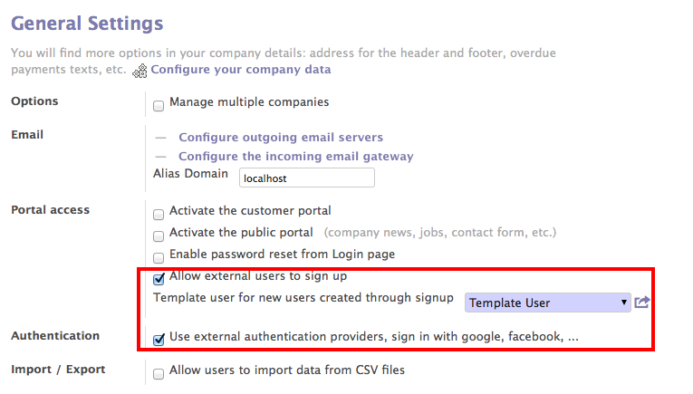

.. _connect-to-openerp:

Connect to OpenERP
==================
OpenERP allows several methods of connecting, basic and default method is to connect is through your database user and password. Other ways to connecting to OpenERP are based Oauth an open protocol to allow secure authorization in a simple and standard method.

Signup
------
You can configure an OpenERP for end users to signup by them self using their Email, username and password or using Oauth based authorization systems such OpenERP, Google, Facebook, Linkedin, etc..

OpenERP have developed his own Oauth authorization system based on the specifications, You can use OpenERP to signup and login with the OpenERP account on your local setup.

.. image:: images/openerp-signup.png

OpenERP Signup

Enable few settings and you will be ready to allow your endusers to sunup on your local setup of OpenERP.

General Settings of OpenERP

Connect to OpenERP
------------------
Now you are ready to signup in your local database using accounts of OpenERP. Click on the "Login with OpenERP.com" button you will be redirected to the OpenERP's signin page, on successfully login, you will be redirect back to your database with new login created as as the Template User with the same name then your name in OpenERP.

.. image:: images/login-signin.png

Login Page
----------
By default OpenERP Online use signup and login with the OpenERP account only. Same way you can enable signup and login with Google, Facebook, Linkedin as well. We will explain in detail about that under the Administration part of this book.