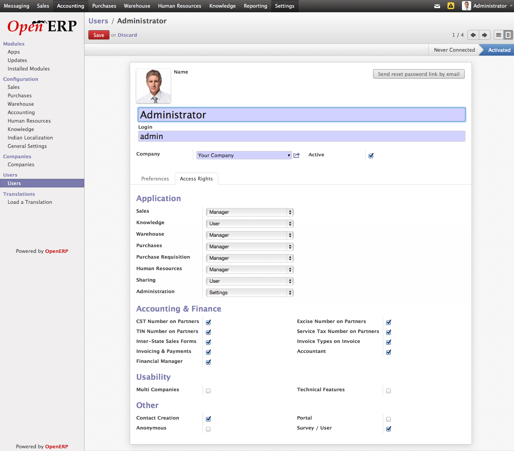

.. _user-config:

.. index::
   single: Configuring Users
   single: Groups Settings

Configuring Users
=================

Many of the business application gives your very lower level of configurations to control the user with in Organization, like Access Controls (Read, Write, Delete, Create), restriction of performing some business functions, Groups, etc.., which are very complex to setup and keep maintained without understanding those properly.

Setting up the users and it's configuration in OpenERP is improved version to version, as it allow you to link your users with the roles to perform limited business processes within an organization. It gives you a very much interactive way to maintain the users within an organization without entering in to much hassle.

Simply form the list of available profile or roles you have to choose the profile or role for the users you like to assign responsibilities, like under sales you can choose Manager, User with their own leads restriction, or users with having access to watch all leads and OpenERP will apply all the restrictions on Access Control, Menu Access, Record Rules, Views, Etc.. depending on the role you chose for the

Access Control, Configurations

Depending on configurations of users "Access Control" page he/she will be able get the data on their screen and perform operations with in Organization.

Applications
------------
OpenERP is a suites of Business Applications, you can configure each and every applications separately only after the installation on the users page as explained above. The configuration is separated into different groups called applications. Each applications is come with almost two groups or roles, by default "Users" and "Managers" which implies the access on that application depending on the selection on users.

.. image:: images/group-settings.png

Groups Settings

However you can add more groups yourself, if you add custom role in to the application it will make a new group on the configurations page like "Accounting & Finance". So, if you plan to make a new role or business process or availability of some additions fields its better to place those under the Technical Settings applications, which is standard application (group) to group all detail settings.

.. image:: images/technical-settings.png

Technical Settings