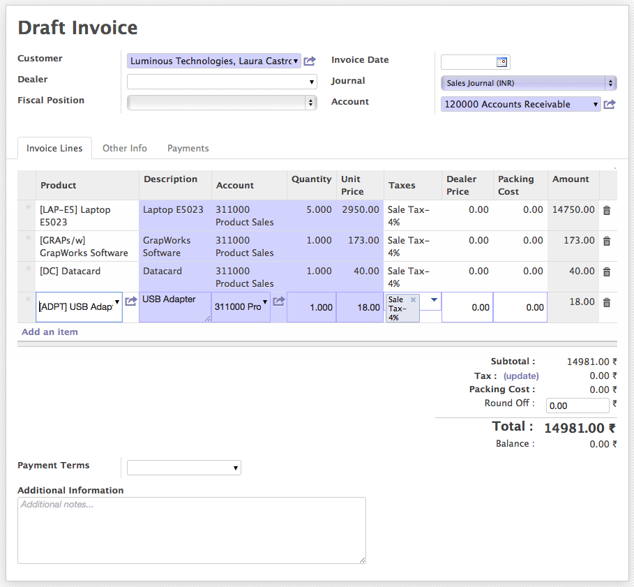

.. _openerp-views:

.. index::
   single: Standard Views
   single: Kanban View
   single: Form View
   single: List View
   single: Tree View
   single: Calendar View
   single: Gantt View
   single: Diagram View
   single: Search View
   single: Special Views

Working with different views
============================

Business application with simplicity in use was dream for all the the big players of business applications in market, OpenERP made this dream comes true with very usable applications. 
Only due to the lots of research in the area of Usability that transform whole application in to really usable version by version.

OpenERP's views are designed in such way that any user can adapt it easily in business. Forms are looks like a paper-sheet, List views are flexible to configure and groups and short on any visible columns..
Some of the object you may get Chart and Calendar Views too. Some views are special like Gantt View for Project Management, Manufacturing Planning and Diagram View Workflow Design which are specific applications.
The new view introduced since OpenERP version 6.1 was Kanban which is a new methodology to define the pipes, stages or part of business process.

.. image:: images/view-switch-01.png

Switch between views 01

.. image:: images/view-switch-02.png

Switch between views 02

Standard Views
--------------
* Kanban View
* Form View
* List View
* Tree View
* Calendar View
* Gantt View
* Diagram View
* Search View

Lets see how you can make your life simple by efficiently working with the different view in OpenERP.

Kanban View
~~~~~~~~~~~
Since the OpenERP version 6.1 this view is introduce and applied to many objects to simplify the business process. A kanban view is also know as kanban board, It is one of the tools which can be used to implement the kanban method for a project.
Kanban boards are perceived as a variation on traditional kanban cards. Instead of the signal cards that represent demand or capacity, the board utilizes magnets, plastic chips, colored washers or sticky notes to represent work items. Each of these objects represents an item in a business process and it moves around the board.

.. image:: images/kanban-view.png

Kanban View of Opportunity 

Depending on the objects you may get an options on clicking on the right-top corner on each activity. Some of the options like Edit, Delete, Color Grid to change colors are available for all the objects while some of the options are specific to objects.
It is fully configurable depending on the objects, You can change the columns to decide and apply your business process and Kanban Board will be designed according. Like the Kanban Card ``you can move any item to any place`` on Kanban Board.

Form View
~~~~~~~~~
OpenERP have introduce the new kind of form view since the version 7.0 which give the feel like user are working with the paper-sheet. While working with the invoice it give you feeling like are preparing the invoice on paper.

Form View - Edit Mode

There is nothing much difference between Invoice in Edit mode and Invoice in Printed format. Since the version 7.0 form is having two different modes edit and readonly so depending on the mode form may display different on your screen. Look at the form view in readonly view it display customers full address as below. 

.. image:: images/form-view-readonly.png

Form View - Read Mode

.. note::
	This document is not finished yet.
