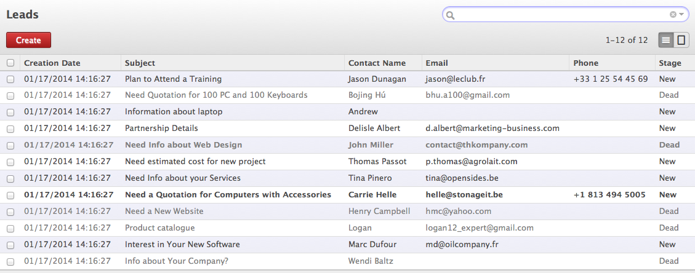
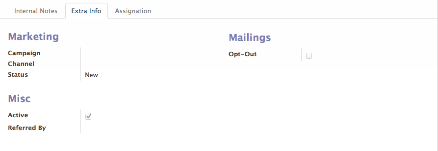
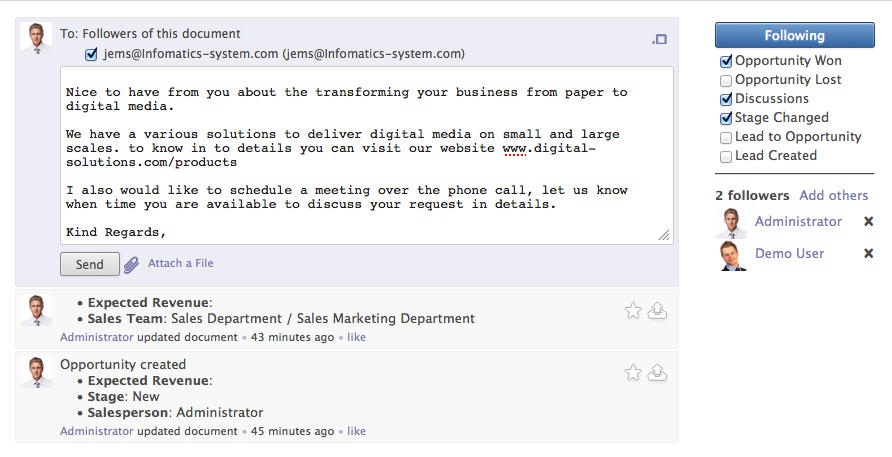
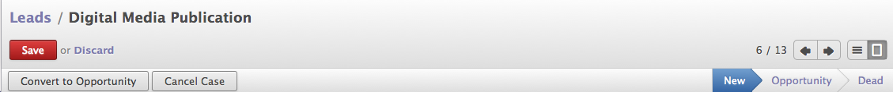
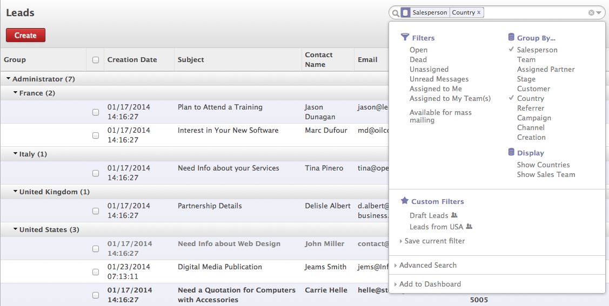

.. _leads-manual:

Create and working with lead in OpenERP
=======================================

In OpenERP after :ref:`installing CRM module <install-crm>`, you can create and manage all the future sales like prospects or sales inquiries by creating Leads which might get convert in to sales for company. Leads may come from various source and different kind of activities for example creating a leads based on marketing over different media like Paper, Television, Phone, SMS, and the most popular one which is marketing over the internet through social media.

The process of creating leads automatically is called leads generations process and most of the business required to invest a lot to generate the leads. Leads contains many useful informations used in marketing campaign to qualify the leads or can be qualified manually by communicating on the same. Most informations on the leads are contact informations, where it comes from, geographical information, etc..

List of Leads in OpenERP

Create Lead
-----------

Lets create a first lead into OpenERP based on the business card we receive through meeting, which is a traditional approach of generating leads.

.. image:: images/lead-form1.png

Create Lead

**Subject**

In order to create a lead you just need only field which is subject. It depends on you what to keep in this fields when you are creating manually, in case of automatic generation of leads it depends on your you create this fields based on the visitor data. Normally it use to identify the leads easily in system.

**Company & Contact Name**

Name of the company from you received the leads, and contact person in that company. It is good to have a contact person information on the leads will be easy to communicate with them during phone call or automated emails through marketing campaign.

**Address**

Its full address of the company or contact person with postal code. well, It is not much important for the movement except if you need it for the further communications in order to send some marketing material, Cd's or Books through post.

**Email**

Most important fields which is used during the marketing campaign to contact prospect customer to through email. When you are generating automatic lead through emails, it is use to link Customer fields on leads automatically.

**Phone, Mobile & Fax**

It is also an important details to get in tough with the prospects, you can easily contact to prospects through phone calls, marketing campaign through SMS, or automated phone calls through smart Voip solutions.

**Internal Notes**

It is text message used by the sales person when prospecting the future customer. based on this salesman communicate with the prospect over the call or email communications.

When you generate leads through your website, It will be easy to streamline subject field and internal notes to filters the leads easily. You should define some of the important fields carefully on your website form that is fillers by the visitors, some of them are as below.

Email Address, Contact Name, Primary Interest, and Questions if any. Look at the best ever form simple leads capture form.

Extra Information on Lead

**Marketing Options**

When you are generating and qualifying leads with marketing campaign those fields are important. you can list an leads to existing marketing campaign just by selection campaign  on lead. Channel is the type of media through which lead is generated, and status  showing the current state of lead by default it is in new when you qualify it goes to Opportunity and dead when not qualified may be used in further marketing.

**Mailing**

If opt-out is checked this contact or lead refuse to receive emails through mass emails or marketing campaigns . Filters "Available for Mass Mailing" allows you to filter the leads when performing mass mailing.

Communicate on Leads
--------------------

A new feature in OpenERP 7.0, Social Enterprise Communications provides all the communications related to the documents available on the same documents so you don;t need any email client or mail folders to search for the communications related to the leads.

Communications on Leads

Once you define Incoming and Outgoing email servers on the settings, you can start receiving and sending email on every document which is enterprise social enabled, in OpenERP it called chatter when you will see followers who will get intimations on their dashboard or OpenERP wall depending on the channel they are following. You can directly send an email or internal notes for the future reference along with the document attached in chatter.

**Qualifying Lead**

States and other Operations on Lead

When you get positive reply of your email on leads, it shows customer's interested to work with us and finally you can convert it in to opportunity through "Convert to Opportunity" and it will automatically change state from New -> Opportunity.

Tracking Leads
--------------
You can groups the leads and analyze to understand who is overloaded, which team have not enough leads or where are new countries where you started new business ? I thinks those are very important questions to control and take the management decision quickly.

Leads Tracking

You can generate lots of analytical reports directly on screen in list view using the Groups, filters under Advance Search operations.

