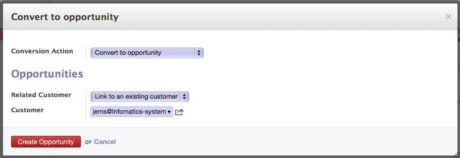
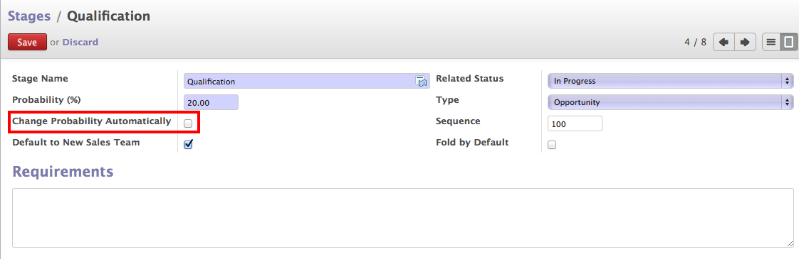

.. _qualify-lead:

Qualify Lead and Convert in to Opportunity
==========================================

In OpenERP after :ref:`installing CRM module <install-crm>`, you can create and manage all the future sales like prospects or sales inquiries by :ref:`creating manually <leads-manual>` or :ref:`create automated <leads-automatic>` Leads which might get convert in to sales for company.

Convert to Opportunity
""""""""""""""""""""""

Once you qualify the lead, you may convert them in to Opportunity by creating a new or merge with the existing one and link those with existing customer or create a new one and link them.

Convert Lead to Opportunity

Click on "Convert to Opportunity" and you will get the opportunity created in New Stage. OpenERP gives you a different pipes in terms of Kanban view to mange the opportunities  into depending on the stage of the opportunity. However you can change those pipes based on your needs or sales process you choose.

.. image:: images/opportunity-board.png

Opportunity by Stages

In Kanban view each column represents a Pipe, and opportunities link on them can be move to another pipe just by drag and drop, depending on the probability and possibilities of the opportunity.

Opportunity Form
""""""""""""""""

.. image:: images/opportunity-form.png

Opportunity Form View

In OpenERP, many information you get on the opportunity comes from lead like Subject, Email, Phone, Internal Nots and all communication, etc..

A good salesman does not forget to put the Expected Revenue, Probability to close the deal and Expected date to close the deal on Opportunity when you assigned to him / her.

**Next Action & Date**

Salesman can put the next action date and action to perform on that date to progress on the opportunity. Salesman can easily check TODOs on their opportunity pipes to  work on every day based on the next actions.

**Expected Revenue & Probability**

The revenue can be generated by proposing the products for which prospect is interested is usually encode as a expected revenue and probability is calculated based on the stage of the opportunity.

Probability of the opportunity can be changed automatically if you choose to do so, based on your stage configuration. You may found the configuration of the stages under Sales → Lead & Opportunities → Stages and you change the required configurations.

Stages of Opportunity

**Expected Closing Date**

The future date by which the opportunity expected to win by the salesman. This date is used to compute the forecast revenues months by months with respect to the probability of the closing the opportunity.

Expected closing date is simply based on the sales cycle of the product you selling.

**Categories**

Used for the classification of the Opportunity by anything you want, here I took an example of the Type of Solution and Platform on when they need so that i can classify easily for the future operations like emailing or some special offers based on the stages they are.

**Miscellaneous Option**

.. image:: images/opportunity-misc.png

Miscellaneous Options

You can track the opportunity history form Misc option under Lead Tab. You can get the number of days since the Opportunity / Leads exist in the system, Days Close represents that since how many days Opportunity closed wither by Winning or Loosing.

