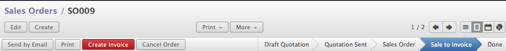
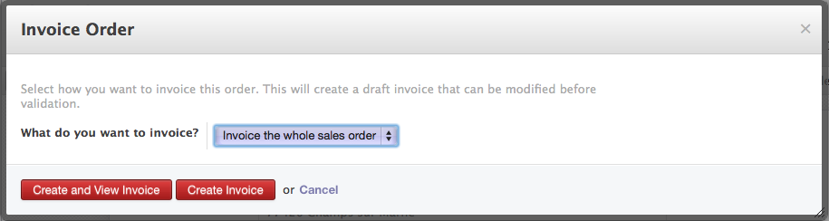
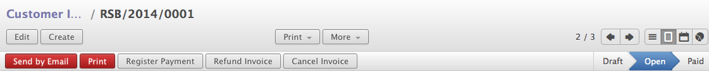
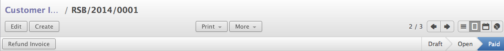

.. _make-invoice:

.. index::
	single: Invoice to Customer
	single: Payment from Customer

Send Invoice to Customer & Register Payment
===========================================
Based on the confirmed sale order we  can generate the invoice and send it to the customer. However it is depends on the invoice policy available on the sales order. When you have not installed Warehouse ``stock`` module you can create an invoice from the Sales order according to the default invoice policy.

Options available on confirmed sales order 

Create an Invoice
-----------------
Click on the "Create Invoice" button to create an invoice, Select "Invoice the whole sales order" and click on the "Create  and View Invoice" will open a draft invoice created based on the sales order. There is a provision to generate partial invoice based on percent or fixed amount so that you can make many partial invoice.

Create an Invoice

Create Invoice - Options
~~~~~~~~~~~~~~~~~~~~~~~~

* Invoice the whole sale order : word itself says that create a full invoice
* Percentage : Create an invoice on the percentage of full sales order. i.e. 50% of the full sale order 
* Fixed Price  Create an invoice based on some fixed amount
* Some Order Lines : Create an invoice based on the order lines, so you can invoice from some lines

Validate Invoice
----------------
Once the invoice is created we can review and confirm the invoice to write an accounting entries in to account. Informations on invoice are transfered from sales order itself, to there will not be any errors in computations. 

.. image:: images/invoice.png

Invoice View

Customer
~~~~~~~~
A Customer to whom we raise an invoice based on the sales order. 

Invoice Date
~~~~~~~~~~~~
Date of the invoice, a same date will be written on the books when we encode sales invoice. 

Journal
~~~~~~~
A Book in which we encode the sales invoice, In case if we maintain the multiple books to encode the sales invoice we have choose the correct one here. (i.e. Tax Sales, Retail Sales, Export Sales, Etc..)

Account
~~~~~~~
A Receivable account will be select automatically based on the selected customer. 

.. hint:: Receivable Accounts per Customer

    If you would like to maintain separate receivable account per customer create an account and link it to the customer receivable account. A same account will be select on selection of customer.
    
Invoice Lines
~~~~~~~~~~~~~
Depending on what we sale a lines will be transfer from Sales Order to invoice, however you can create a direct invoice without products as well. You need to pass the description, Quantity, Price Unit and Taxes if applicable, A sales account will be selected form the Journal selected on Invoice.

Invoice Total
~~~~~~~~~~~~~
Total of the invoice computed based on the Quantity, Price Unit, Taxes, Discount if applicable. It computes Sub-total which does not includes Taxes, and final Total which includes Taxes.

Payment Terms
~~~~~~~~~~~~~
A Payment terms defines the time limit by that customer has to clear the account. It depends on business relation with customer you can choose payment terms depending on customer. However you can configure the payment terms on the customer that will be selected in invoice automatically.

Validate Invoice
~~~~~~~~~~~~~~~~
Once the invoice gets validated for some of the key fields you can click on the ``Validate`` button to confirm the invoice and it changed state from Draft to Open, It also encode the related accounting entries in accounting system. 

Validate Draft Invoice

Register Payments
-----------------
Once invoice gets Validated, we can register the payment depending on how payment arrive. Lets assume that Axelor paid an invoice through cash, we can register the payment directly on the Invoice.

.. image:: images/pay-invoice.png

Pay Invoice by Cash

Customer
~~~~~~~~
A customer to whom we raised an invoice an received payment, will be filled automatically on invoice. 

Date
~~~~
A Data on which payment gets reflect in your Bank, Cash, Etc...

Period
~~~~~~
A Fiscal period will be filled depending on the date selected that shows when the payment gets reflected. 

Paid Amount
~~~~~~~~~~~
The amount received from customer through bank checks, cash, etc.

Payment Ref
~~~~~~~~~~~
You can define reference of the payment received through i.e. in case of payment received through bank we can put the bank checks numbers or transaction numbers if Telegraphic transfer.

Memo
~~~~
A Free text where you can write anything related to the payment transaction.

Difference
~~~~~~~~~~
In case if we get the partial payment, we will get the difference amount which is ``Difference = Outstanding - Current Payment`` and we can have a choice to either close the account by writing off the remaining payment or keep open and wait for the remaining payment from customer for the same invoice.

So, after successfully cash payment done, invoice state will get change form Open to Paid and it shows that we received the payment in to the pocket wither through bank or cash.

Invoice closed
