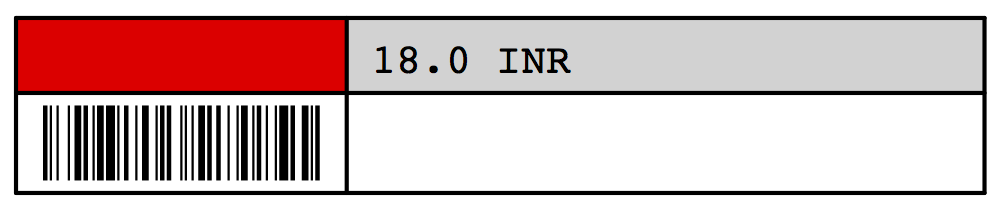

.. _setup-products:

.. index::
	single: Products
	single: Product Category
	single: Sale Price
	single: Cost Price
	
Setup Products and Category
===========================

.. image:: images/product.png

Product basic configuration

After :ref:`setup the customer and suppliers <setup-customer-supplier>` next to setup is Products in order to start sale or purchase. Two important fields need to enter to create a new product ``Name`` and ``Category`` of the product.

Can be Sold and Can be Purchase are the two checkbox used to define product is available for sales and purchase process. If you select product to to be sold you can get more options on product to configure Sales options. 

Product Information
-------------------
All prerequisite information for the product like it is stock-able to not sales price, and references. 

Product Type
~~~~~~~~~~~~
We can define product as a physical product or service in OpenERP. It support below list of options to define the product type. 

* Stockable Product : Use to define a product which valuation count in to the inventory and issues or transfer possible only if the stock available in warehouse. 
* Consumable : Movement in warehouse is possible but does in include in inventory valuations, as it does not takes care for the stock to do such movements in warehouse.
* Service : A product which can not be stock in warehouse, but can be sale or purchase.

Sale Price
~~~~~~~~~~
A fixed price use to define a price for the public. Sale order capture this price when we sale product.

Internal Reference
~~~~~~~~~~~~~~~~~~
Code name for the product used to search the product quickly during various operations like sale or purchase.

EAN 13 Barcode
~~~~~~~~~~~~~~

EAN 13 Barcode for 0075678164125 product code
 
A 13 digit International Article Number use to define a barcode data. 

Description
~~~~~~~~~~~
Define the product specification use to describe product technically. 

Product Procurement
-------------------
Informations related to the product procurement & supply method, suppliers of the product.

.. image:: images/product-procurement.png

Product procurement configuration

Procurement Method
~~~~~~~~~~~~~~~~~~
Define the method of procuring when you sale product using any of and of the below methods.

* Make to Stock : When you sell this product, OpenERP will use the available inventory for the delivery order. 
* Make to Order : OpenERP will trigger a draft purchase order to buy the required quantities to the supplier. The delivery order will be ready after having received the products.

.. note::
	When your procure method is ``Make to Stock`` and if there are not enough quantities available, the delivery order will wait for new products. To fulfill the inventory, you should create others rules like orderpoints.

Supply Method
~~~~~~~~~~~~~
Supply method is working with the procurement method, combinations of the this two configuration define how to get the product when needed.

==================		=================		==========================================================================================
Procurement Method		Supply Method			Result
==================		=================		==========================================================================================
Make to Stock			Buy						If stock is available assigned from warehouse, else it will execute the orderpoints
Make to Order			Buy						Straight away create a purchase order for the defined first supplier available on product.
Make to Stock			Manufacture				If available assign from stock else create a manufacturing order
Make to Order			Manufacture				Create a manufacturing order when there is a Sales order
==================		=================		==========================================================================================

Cost Price
~~~~~~~~~~
Cost price for the product, either comes from the supplier or manufacturing cost for the product.

Delays
~~~~~~
Delay in days to process the manufacturing order.

Suppliers
~~~~~~~~~
All the suppliers who supply this product and possible to place order to any any form them. Yet no intelligent selection of the supplier is not implemented in OpenERP to select the supplier when need to create a Purchase Order through Procurement.

Description
~~~~~~~~~~~
Product specification use to describe product to supplier, it is simply supplier specific product description.

Inventory Information
---------------------
Informations related to the stock and locations of the products can be found under the this tab.

.. image:: images/product-inventory.png

Inventory Information

Quantity on Hand
~~~~~~~~~~~~~~~~
Available quantity in warehouse can be assign for the delivery. You have to keep in mind that once we assign quantity to delivery it will not deduct from the available quantity. 

Incoming
~~~~~~~~
Sum of all the quantity that booked as incoming shipment for related product.

Outgoing
~~~~~~~~
Quantity assigned for the product to the delivery orders, will be deliver in future.  

Forecasted Quantity
~~~~~~~~~~~~~~~~~~~
Virtual quantity is a computed quantity based on the Quantity on hand, Incoming and Outgoing quantity. ``Virtual Quantity =  Quantity on Hand + Incoming - Outgoing``

There are some informative fields too, like status, product manager, and locations of the storage. 

Sales Information
-----------------
Specify some of the information like time to delivery the product, warranty if any available with the product, and technical specification that appear on the sale order at the time of sale.

.. image:: images/product-sale.png

Sale Information

Accounting Information
----------------------
Accounting information linked to the product use while sales and purchase like Taxes and Income and Expense account. 

.. image:: images/product-accounting.png

Accounting Information

Income and Expense Accounts
~~~~~~~~~~~~~~~~~~~~~~~~~~~
During the sales and purchase process income and expense accounts use to encode the financial transaction, most of the time on product those accounts are not set as it takes those accounts form the category. However you can set those accounts on the product for different income and expense account and it will override the configuration of the accounts defined in product category.

Customer & Supplier Taxes
~~~~~~~~~~~~~~~~~~~~~~~~~
It is the default tax that applied when we make a purchase or sales,  the label should be default Sales & Purchase Tax instead of Customer and Supplier Tax. 